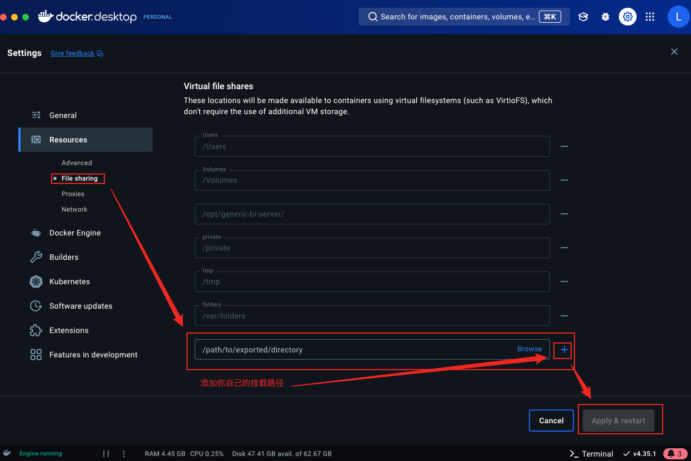

# Generic-bi-server
一个通用的bi系统,目前支持Clickhouse Postgre Mysql的数据可视化

## Getting Started

## 安装postgre
下载地址 https://postgresapp.com/downloads.html

客户端推荐: https://eggerapps.at/postico/v1.php

## 创建数据库
CREATE DATABASE bi;
\c bi

## 创建用户
超级管理员 postgre下：
CREATE USER genericbiserver WITH PASSWORD 'genericbiserver@123';

给权限
```sql
grant all on schema public to genericbiserver;

GRANT ALL PRIVILEGES ON ALL TABLES IN SCHEMA public TO genericbiserver;

GRANT SELECT, INSERT, UPDATE, DELETE ON ALL TABLES IN SCHEMA public TO genericbiserver;

grant all on table_name to genericbiserver

```


## 安装redis
下载地址  https://redis.io/docs/latest/operate/oss_and_stack/install/install-redis

## 安装依赖
```bash
cd /packages/bi-common

# 中途遇到错误的话 就执行一下 yarn build 再执行 yarn
yarn 

```

## 运行 

```bash
# 后台服务
cd /packages/bi-manager
yarn workspace @bi/manager run dev


# web服务
cd /packages/bi-manager-web
yarn start
```
---

## Yarn workspace 版本

### 依赖树关系

```bash
yarn workspaces info 
```

### 安装/删除依赖模块

```bash
# packageA 安装 axios
yarn workspace packageA add axios

# packageA 移除 axios
yarn workspace packageA remove axios
```

### 运行单个 package 的scripts 命令

```bash
# 运行 @bi/common 的 build 命令
yarn workspace @bi/common run build

# 这里是在每个工作区运行 run build 命令
yarn workspaces run build
```

### 前置依赖

由于 yarn workspace 未实现拓扑排序规则，所以只能手动先打包 `@bi/common`

```bash
yarn workspace @bi/common run build 
```

### Run server

```bash
yarn workspace @bi/manager run dev  
```

### Run web

```bash
yarn workspace @bi/manager-web run start  
```

---

## Lerna 版本

### 列举当前包含的包

```bash
$ lerna ll
```

### 前置依赖

> 或者是使用 lerna 的拓扑排序规则执行命令
> `lerna run --stream --sort build`

```bash
$ cd packages/bi-common && yarn run build
$ lerna bootstrap
```

### Run server

```bash
$ cd packets/bi-manager
$ yarn run dev
```

### Run web

```bash
$ cd packets/bi-manager-web
$ yarn run start
```

### 新增依赖

⚠️ 新增依赖不可以使用 `yarn add`，必须使用 `lerna add` 命令！

- 如果是多个包的共同依赖

```bash
lerna add echarts
```

- 如果只是某个包的单独依赖

例如在 `bi-manager` 中安装 `@posthog/clickhouse`

```bash
$ lerna add @posthog/clickhouse --scope bi-manager
```


## 安装 canvas
https://wbt5.com/jsdom-canvas.html


---

## Docker

```bash
docker-compose -f docker-compose.dev.yml stop
docker-compose -f docker-compose.dev.yml up -d
```

## Docker构建
在根目录下 执行
```bash
docker build -t generic-bi-server .
```

一些可能有帮助的命令
```bash
docker: psql -h localhost -U genericbiserver -d genericbiserver -d bi

psql -h generic-bi-postgres -U genericbiserver -d genericbiserver -d bi -w genericbiserver@123

psql -h postgres-container -U postgres -d postgres

postgres-container

docker run -d -p 8080:41130 --name=my_generic_bi11 generic-bi /bin/sh -c "tail -f /dev/null"  

docker run -d -p 8080:41130 --name=my_generic_bi22 --network my_network generic-bi /bin/sh -c "tail -f /dev/null"

apk add postgresql-client
```

## 直接运行？
见release分支，下载docker镜像即可