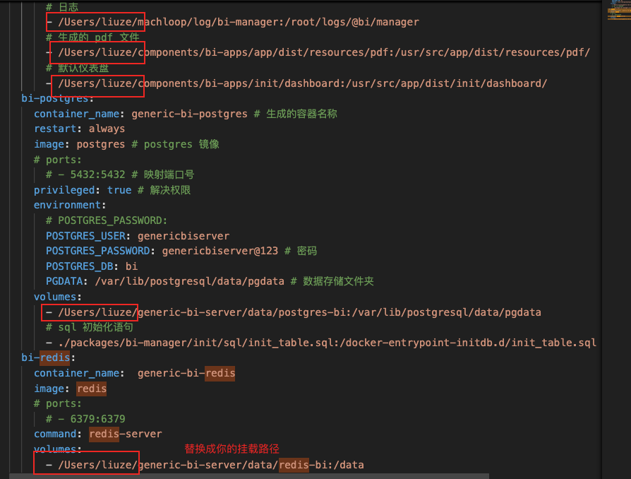

### DOCKER 镜像

#### 使用方式
在release/docker 目录下 执行 docker load < generic-bi-server.tar 即可完成加载

#### 下载依赖
```bash
# 下载postgre
$ docker pull postgres

# 下载redis
$ docker pull redis
```

#### 执行docker-compose 文件
在docker app中，设置


并在docker-compose.yml中 替换你的挂载路径


在docker-compose.yml 目录下，执行
```bash
# 启动/更新
$ docker-compose up -d

# 停止
docker-compose down
```

#### 访问
访问 http://127.0.0.1:41130 即可